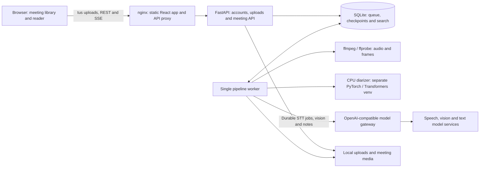

<p align="center"></p>

# Quill

**Record the meeting. Keep the decisions.**

**Quick-Quotes Quill** turns meeting recordings into something you can read. Drop in a
video (up to 10 GiB) or an audio file and get a speaker-attributed transcript, the key
slides and screens, a summary with chapters, decisions and action items, all linked back
to the moment they were said. Unlike Rita Skeeter's quill, this one quotes people accurately.

Self-hosted, CPU-only on the app side, built by [Team AER](https://github.com/Team-AER).

## Features

- **Uploads that survive bad Wi-Fi**: resumable [tus](https://tus.io) uploads in 64 MiB
  chunks, up to 10 GiB, drag and drop anywhere.
- **Who said what**: speaker diarization on CPU with
  [`nvidia/Nemotron-3-Diarization`](https://huggingface.co/nvidia/Nemotron-3-Diarization)
  (up to 8 speakers), then transcription per speaker turn.
- **Key moments**: scene changes and transcript cues pick frames; a vision model reads
  slides and screens, so text on screen is searchable.
- **Notes**: TL;DR, summary, chapters, decisions, open questions and action items, each
  grounded to a timestamp.
- **A reader built for meetings**: video or audio player with chapter ticks, a meeting map
  (speaker lanes, key frames), a follow-along transcript with speaker filters, ⌘K to jump
  anywhere, full-text search across every transcript and slide, exports (Markdown, TXT, SRT,
  VTT, JSON, RTTM).
- **Live progress**: every stage reports over server-sent events. If a model is turned off
  in the gateway, Quill pauses and resumes; it never counts that as a failure.
- **Accounts for a small team**: admins and members, link-based invites and password resets
  (no mail server needed), per-meeting sharing (view or edit, or everyone on the install),
  device sign-out. See [docs/ACCOUNTS.md](docs/ACCOUNTS.md).

## How it works



Every stage checkpoints, so a restart resumes where it stopped. The React frontend is a
static build served by nginx in front of the API.

| Part | Stack |
| --- | --- |
| `backend/` | Python ≥3.12 (Docker uses 3.14), FastAPI, SQLite (WAL, FTS5), a single worker process |
| `diarizer/` | PyTorch CPU + Transformers, own venv, called as a subprocess |
| `frontend/` | React 19, Vite, TypeScript, no UI framework |
| `deploy/` | Proxmox LXC provisioning, Docker images + compose (`deploy-docker.sh`), nginx, backups |

### What the model gateway must provide

Quill talks only to one OpenAI-compatible gateway (`QUILL_GATEWAY_URL`). It was built
against Team AER's llm-proxy with [Avifors](https://github.com/Team-AER/avifors) behind it,
and expects:

- `POST /v1/chat/completions` with JSON-schema structured output, and a model that accepts
  images (frames and notes; Gemma 4 12B by default).
- A durable speech-to-text jobs API: `POST /v1/audio/transcriptions/jobs`, `GET .../jobs/{id}`,
  `GET .../jobs/{id}/result`, `DELETE .../jobs/{id}` (see `backend/quill/pipeline/stt.py`).
- `GET /catalog.json` with each model's status, so Quill can pause when a model is disabled.

## Quick start

Clone the project first:

```sh
git clone https://github.com/Team-AER/quill.git
cd quill
```

**Frontend only (no backend needed).** The dev server includes an in-process mock of the
whole API with sample meetings, people and shares:

```sh
cd frontend
npm ci
npm run dev          # http://localhost:5180, sign in as admin@quill.test / quill-dev
```

Use Node.js 24, as in the Docker build. The mock demonstrates the interface; it does
not transcribe recordings. Run subsequent commands from the repository root.

**Backend and tests.**

Install Python 3.12 or newer and `ffmpeg` (including `ffprobe`). Python 3.14 is the
Docker default. These commands use Python 3.12; substitute your installed version.

```sh
cd backend
python3.12 -m venv .venv
.venv/bin/pip install -e '.[dev]'
.venv/bin/python -m pytest -q
```

For real processing, install the separate diarizer using [diarizer/README.md](diarizer/README.md)
and provide the gateway routes above. In each backend terminal, set:

```sh
cd backend
export QUILL_DATA_DIR="$PWD/.data"
export QUILL_GATEWAY_URL=http://localhost:4000/v1
export QUILL_DIARIZER_CMD="$PWD/../diarizer/.venv/bin/quill-diarize"
# Set the same QUILL_SECRET_KEY in both terminals to a locally generated secret.
```

Run `.venv/bin/uvicorn quill.app:app --host 127.0.0.1 --port 8020` in one terminal
and `.venv/bin/python -m quill.worker` in the other. In a third terminal:

```sh
cd frontend
npm ci
QUILL_API=http://127.0.0.1:8020 npm run dev
```

The first visit to a fresh install shows a setup page that creates the admin account. It only
works from a private or loopback address.

## From recording to useful notes

1. Upload audio or video, choose a title and optional language/speaker hints, or use
   **Audio only** to skip slides and frames.
2. Follow processing in the library: probe, audio extraction, speakers, transcription,
   key moments, frame analysis and notes. Audio meetings skip the two video stages.
3. Open the reader, jump from a transcript line, chapter, slide or meeting map to its
   timestamp, and filter speakers to follow a particular voice.
4. Review names and notes, tick action items, search across transcripts and slides,
   then share with teammates or export for your own tools.

See the [reader guide](docs/USAGE.md) for controls, export formats and limitations.

## Scope and limitations

- Quill processes uploaded recordings; it does not join calls or record a live meeting.
- The app and diarizer run on CPU. Speech, vision and text inference run behind your
  gateway and may require GPUs there. A standard transcription endpoint alone is
  insufficient: the durable jobs API and model catalog are required.
- Self-hosting controls where recordings are stored, but audio clips, selected frames
  and text are sent to the configured gateway. Its deployment determines model privacy.
- Diarization has eight speaker slots. Speaker attribution, transcriptions, slide text
  and generated notes need human review, especially with overlap or poor audio.
- Audio-only meetings have no slide extraction. Video source retention defaults to
  14 days; it is not a policy to delete transcripts or every derived media file.
- The repository is version 0.1.0. The [original plan](docs/PLAN.md) records design
  rationale and historical infrastructure observations, not a current service guarantee.

## Configuration

Settings are `QUILL_*` environment variables. [deploy/quill.env.example](deploy/quill.env.example)
is the deployment template; [backend/quill/config.py](backend/quill/config.py) defines
application defaults and additional optional settings:

| Variable | Default | |
| --- | --- | --- |
| `QUILL_DATA_DIR` | `/var/lib/quill` | database, uploads, media, backups |
| `QUILL_GATEWAY_URL` | `http://localhost:4000/v1` | the model gateway |
| `QUILL_STT_MODEL` | `aer-stt-v1` | admins can switch between ready models in Settings |
| `QUILL_VISION_MODEL`, `QUILL_TEXT_MODEL` | `google/gemma-4-12B-it-qat-w4a16-ct` | |
| `QUILL_DIARIZER_CMD` | `/opt/quill/diarizer-venv/bin/quill-diarize` | |
| `QUILL_MAX_UPLOAD_BYTES` | 10 GiB | |
| `QUILL_VIDEO_RETENTION_DAYS` | `14` | source video only; `-1` keeps it, `0` deletes after processing |
| `QUILL_SECRET_KEY` | | keys the session and link token digests; generated on install |
| `QUILL_PUBLIC_URL` | | the https address, used in invite and reset links |

## Deploying

[deploy/README.md](deploy/README.md) covers running Quill in a Proxmox LXC behind a TLS
reverse proxy: provisioning, releases with automatic rollback, the reverse-proxy settings
uploads need, backups and recovery (`quill-users reset-link` for a locked-out admin).

## Docs

- [docs/USAGE.md](docs/USAGE.md): upload, reader, search, sharing and exports
- [docs/ACCOUNTS.md](docs/ACCOUNTS.md): roles, invite and reset links, sharing, the account API
- [docs/PLAN.md](docs/PLAN.md): the original design plan and its reasoning
- [docs/CONTRACT.md](docs/CONTRACT.md): module boundaries, schema and API contract
- [frontend/DESIGN.md](frontend/DESIGN.md): the UI design language
- [diarizer/BENCHMARK.md](diarizer/BENCHMARK.md): CPU diarization benchmarks

## License

[MIT](LICENSE) © 2026 Team AER.

Model weights are not part of this repository and keep their own licences. The installer
downloads `nvidia/Nemotron-3-Diarization` (OpenMDW-1.1) from Hugging Face; the STT, vision
and text models are whatever your gateway serves.
